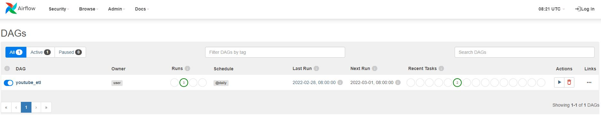

# Youtube Video ETL Scheduler with Airflow

**Summary**
---
In this project I attempt to create an Extract, Transform, Load (ETL) pipeline using Python and Airflow and its scheduler. The pipeline will retrieve all video-related statistics for all videos or selected amount of videos from a given Youtube channel based on the channel name. The scheduler will run daily so that a time series record is generated for statistics such as view count, comment count, like count.  

**Background Information**
---
The free YouTube Data API V3 grants access to video-related data on youtube. The API key is available at https://console.developers.google.com/. The data obtained from the API is limited in the sense that each call to the API will only return the current count for variables such as view count, comment count, like count. There is no historical count available. Even though the API does not offer the option to retrieve historical record, setting up a scheduler will allow us to generate a time series record in variables such as view count, on an ongoing basis with a starting date set by the scheduler.

There are several ways to access video-level data on the Youtube API. In this project, I use playlist id for a given channel id. All video ids are retrieved from the playlist id. One limitation of this approach is that this pipeline is only compatible with Youtube channels that place all of the videos in a playlist. 

The input variables are
1. API Key-user specific
2. Channel Name-name as shown on the youtube channel
3. Maximum Video Count-Youtube Data API V3 has a cap of 10,000 units per day. User can set the maximum to avoid making too many API calls when the Channel has too many videos

**Step 1: Set up PostgreSQL Database and Create Table**
---
* For this project, I create a PostgreSQL Database locally using pgAdmin 4. After creating the database, I recorded the hostname/database/username/port_id
* Run [create_table.py](https://github.com/RonaldLi-GitHub/Youtube_Video_ETL_Scheduler/blob/main/create_table.py) to create the Youtube_Vid table that will store all data coming from the pipeline later on

**Step 2: Create Template to Retrieve Youtube Video Statistics**
---
* [extract_transform_youtube_data.py](https://github.com/RonaldLi-GitHub/Youtube_Video_ETL_Scheduler/blob/main/extract_transform_youtube_data.py) contains the code for this section
* The general steps are
  1. Retrieve the playlist id based on channel id
  2. Use the playlist id to retrive video id
  3. Locate all video ids from each channel(Note: each page shows a max of 50 videos, thus nextPageToken is required to load the next page, the process continues until there is no more nextPageToken on the current page.)
  4. For each video id located, retrieve all relevant information such as publish time, view count, like count, etc...
* Each single run of the template will generate a pickle file containg the dataframe

**Step 3: Prepare Dag File to Schedule the Workflow with Airflow**
---
* [dag.py](https://github.com/RonaldLi-GitHub/Youtube_Video_ETL_Scheduler/blob/main/dag.py) contains the code for this section
* The dag file performs 2 tasks
  1. Get youtube data - this is Step 2
  2. Load youtube data - the dataframe generated from Step 2 will be loaded into the table in the PostgreSQL Database that was set up in Step 1
* The dag file allows the user to select a starting date, schedule interval, time zone. In this project, I select an interval of daily, so that the scheduler runs everyday at 12:00am pacific time

**Step 4: Start Airflow Scheduler**
---
* To run Airflow on Windows, the user will need to install Ubuntu on Windows Subsystem for Linux
* [extract_transform_youtube_data.py](https://github.com/RonaldLi-GitHub/Youtube_Video_ETL_Scheduler/blob/main/extract_transform_youtube_data.py) and [dag.py](https://github.com/RonaldLi-GitHub/Youtube_Video_ETL_Scheduler/blob/main/dag.py) should be in the same folder
* On the command prompt, I enter the following commands
  * airflow db init
  * airflow webserver -p 8080
  * airflow scheduler (on a separate Ubuntu session)
* The airflow UI will appear in the brower 
* Here are some screenshots

 
 

**Trial Run Result**
---
To test the pipeline, I go to LevelCapGaming's channel and retrieve 12 videos and schedule the workflow to run on 3 consecutive days. I then retrieve the data from the database. The result is the following when I filter on just one video

As expected, the pipeline is able to generate time series record of view count, like count, comment count.
